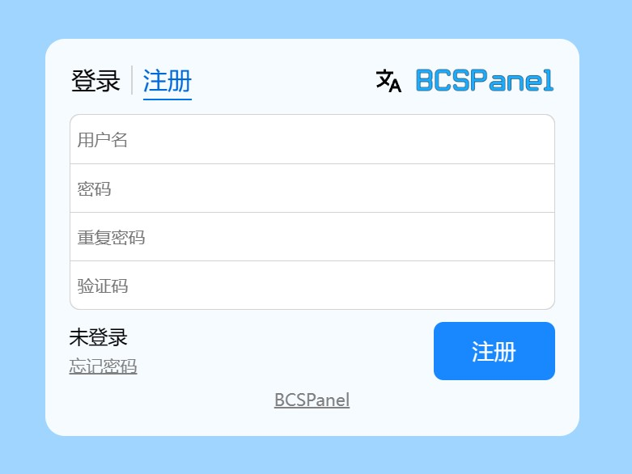
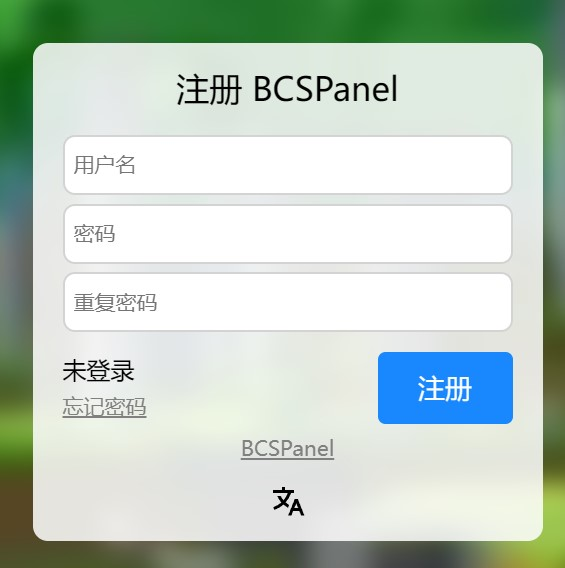
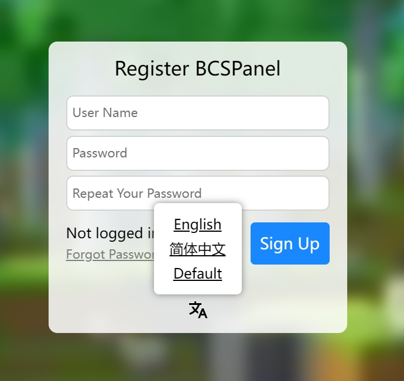
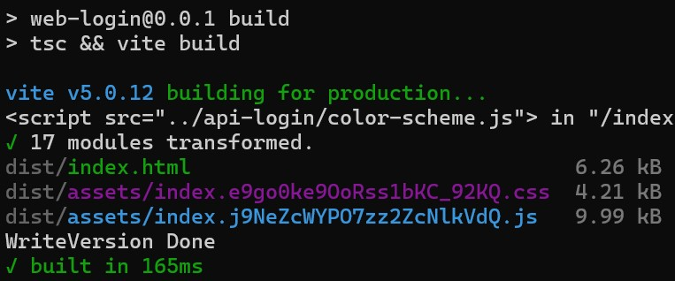
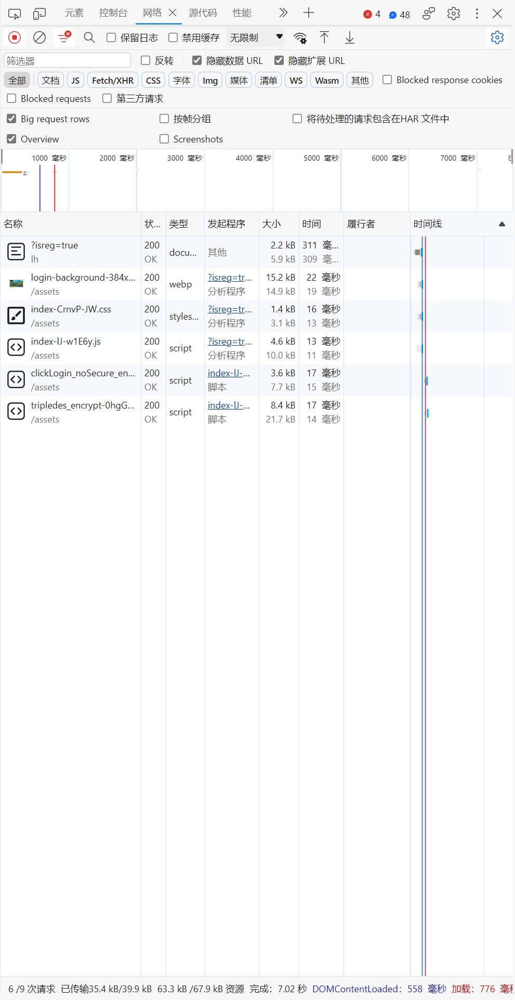

# BCSPanel-web-login

[BCSPanel](https://github.com/bddjr/BCSPanel) 的登录页面，体积小巧，使用 [Vite](https://cn.vitejs.dev) + [TypeScript](https://www.typescriptlang.org) 编写。  

请使用最新版本的 [Google Chrome](https://google.cn/chrome/) 或 [Microsoft Edge](https://www.microsoft.com/zh-cn/edge/download) 浏览器访问，确保一切正常运行。  
会尝试适配最新版 [Mozilla Firefox](https://www.mozilla.org/zh-CN/firefox/browsers/) ，但不保证它正常显示。  

实测 Chrome 66+ 才能使用，Chrome 76+ 才能模糊背景。[（测试平台是 browserling ）](https://www.browserling.com/)

[点此访问预览界面。](https://bcspanel-web-login-preview.bddjr.com/)

[使用MIT开源许可协议。](https://mit-license.org)  

***
## 开始

下载源码并补全依赖
```
git clone https://github.com/bddjr/BCSPanel-web-login
cd BCSPanel-web-login
npm install
```

开发者实时预览
```
npm run dev
```

构建
```
npm run build
```

挂载预览（需要先运行构建）
```
npm run preview
```

构建并挂载预览
```
npm run bview
```

***
## 图

不保证是最新版本的截图，仅供参考











